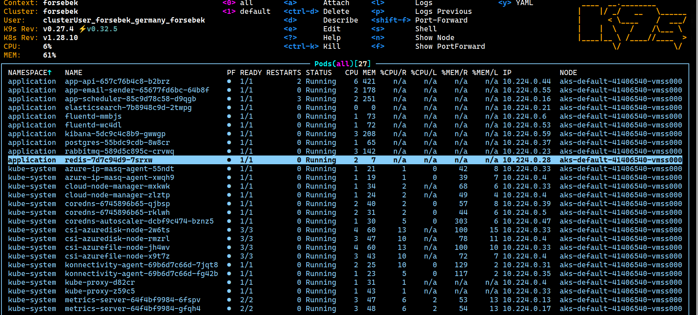
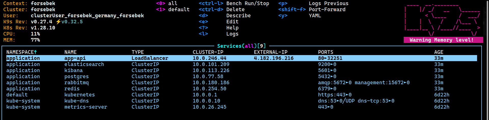

# todo-list-iac


### Create [AKS](https://learn.microsoft.com/en-us/azure/aks/what-is-aks) and [ACR](https://learn.microsoft.com/en-us/azure/container-registry/):

_There are different ways to create Azure resources.
You can create a resource either by means of `Azure CLI` or `Terraform` or `Web UI`._
_But we recommend you to use Azure CLI + Terraform to create necessary resources._

### Guides:

1. [Guide to setup your cluster via Azure CLI + Terraform](./terraform/)

2. [Guide to setup your cluster manually via Web UI](./docs/guide-webui/README.md)

---

### After you create [ACR](https://learn.microsoft.com/en-us/azure/container-registry/container-registry-get-started-azure-cli):

1. **Login to ACR**

   If you create resources via Terraform,
   you can find your ACR admin creds in the terraform output.

2. **Push images to ACR**

<kbd>
  
  
</kbd>

---

### Steps to deploy the application to [AKS](https://learn.microsoft.com/en-us/azure/aks/what-is-aks):

1. **Create a Namespace**

2. **Create a ConfigMap/Secret for Environment Variables**

3. **Create PersistentVolume and PersistentVolumeClaim**

4. **Create Deployments for each Application Component**

5. **Create Services for each Deployment**

---

### Change the configmap values before deployment:

<kbd>
  
</kbd>

---

### Kubernetes deployment:

```bash
cd k8s-manifests/
make concat  # Concatenate all the files into a single file
kubectl apply -f aks-store-quickstart.yaml
```

---

### Deployment is successful:

```bash
namespace/application created
configmap/app-config created
persistentvolume/postgres-pv created
persistentvolumeclaim/postgres-pvc created
persistentvolume/redis-pv created
persistentvolumeclaim/redis-pvc created
deployment.apps/postgres created
deployment.apps/app-api created
deployment.apps/app-email-sender created
deployment.apps/app-scheduler created
deployment.apps/redis created
deployment.apps/rabbitmq created
service/postgres created
service/app-api created
service/redis created
service/rabbitmq created
persistentvolume/elasticsearch-pv created
persistentvolumeclaim/elasticsearch-pvc created
deployment.apps/elasticsearch created
service/elasticsearch created
configmap/fluentd-config created
daemonset.apps/fluentd created
deployment.apps/kibana created
service/kibana created
```

<kbd>
  
</kbd>

---

**External IP:**

<kbd>
  
</kbd>

---

### Kibana dashboard:

<kbd>
  
</kbd>
