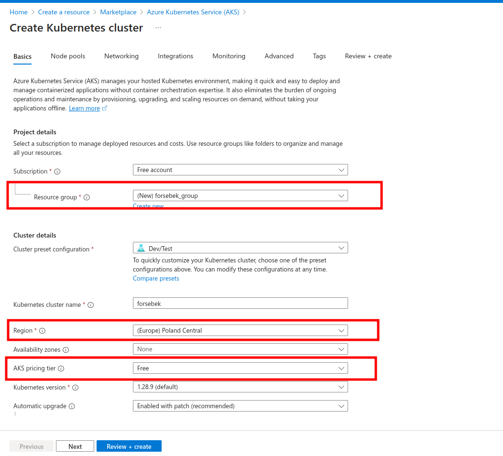

# Manual AKS cluster deployment

**Just a simple guide to deploy an AKS cluster via Web UI.**

### Basic information:

**1. Resource group**

**2. Select a region**

**3. Check that you going to use the proper tier**

---

### Setup your node pools:

**1. Select a node pool**

**2. Select a VM size that corresponds to your needs and quotas**

**3. Select a number of nodes that corresponds to your needs and quotas**

---

### Create or select Azure Container Registry:

---

### Review and create
