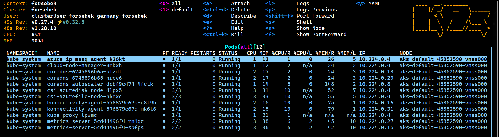

# Create AKS using Terraform


### Terraform code

**[terraform-aks/](../terraform-aks/)**

### Pre-requisites:

1. **[Install Terraform](https://learn.hashicorp.com/tutorials/terraform/install-cli)**

2. **[Install Azure CLI](https://learn.microsoft.com/en-us/cli/azure/install-azure-cli)**

3. **[Install `kubectl` locally, use the `az aks install-cli` command](https://learn.microsoft.com/en-us/cli/azure/aks?view=azure-cli-latest#az-aks-install-cli)**

### Steps to create AKS using Terraform:

1. **Initialize terraform**

2. **Plan terraform changes**

3. **Deploy terraform changes**

4. **Set new k8s context**

5. **Check the context**

_You can also import to your state already existed resources using [`terraform import`](https://www.terraform.io/docs/cli/import/index.html) command._

---

### Initialize terraform:

```bash
terraform init
```

### Plan terraform changes:

```bash
terraform plan -out tfplan
```

### Deploy terraform changes:

```bash
terraform apply tfplan
```

### Set new k8s context:

```bash
az aks get-credentials --name <cluster-name> --resource-group <resource-group-name>
```

### Check the context:

```bash
kubectl config get-contexts`
```

<kbd>

</kbd>

---

### Verify the pods:

```bash
kubectl get pods -n <namespace>
```

<kbd>
  
</kbd>
